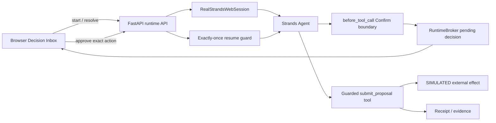

# VÉRTICE Architecture

## Purpose

VÉRTICE separates useful autonomous work from consequential authority. The browser is an interface for a decision already issued by the runtime; it is not the authority source and cannot directly commit the external effect.

## Canonical state model

The implementation exposes the compact runtime phases:

`READY → INTERRUPTED → COMMITTED`

or:

`INTERRUPTED → DENIED`

Conceptually this maps to:

`RUNNING → WAITING_HUMAN → RESUMING → COMMITTED | FAILED`

with `WAITING_HUMAN → DENIED` for rejection.

There is no valid direct transition from `INTERRUPTED` to `COMMITTED` without controlled resolution and runtime continuation.

## Components

A rendered diagram also exists at `docs/architecture.svg`.

## Exact-action authorization

The pending decision is tied to the consequential action and relevant parameters. The canonical demo uses proposal `AFH-DEMO-001` and amount `US$8,750`. The runtime exposes an exact action hash/digest so the approved action can be compared with the action presented for execution.

Approval is not a general-purpose permission. The guarded continuation validates the active pending decision, expected runtime state, exact action, and single-use consumption semantics before the consequential tool can commit.

## Replay and mutation defenses

A successful continuation records a receipt/idempotency identity. Reusing the same authorization does not create a second effect. Changing consequential action data after approval, including changing `US$8,750` to `US$8,751`, is rejected rather than treated as equivalent authorization.

## Trust boundaries

- **Browser:** presents runtime state and submits a decision; it does not declare `COMMITTED`.
- **Runtime API/session:** source of truth for state transitions and decision resolution.
- **Runtime broker/guard:** owns pending authorization and consumption checks.
- **Strands agent:** performs autonomous work and reaches the protected tool boundary.
- **Guarded tool:** performs only the authorized action and records effect evidence.
- **External effect:** deliberately **SIMULATED** in the hackathon demo.

## Evidence and provenance

Release evidence binds runtime certification to an exact commit/source archive. The release gate rejects mismatched runtime evidence, source SHA, or candidate identity. Browser/video freeze and final submission gates are separate layers so evidence from one candidate cannot silently certify another.

## Product-hardening roadmap

The hackathon candidate intentionally keeps the demo bounded. A commercial implementation would add durable session storage, authenticated human identity, provider-backed idempotency, organization policy administration, enterprise audit/export, and production-grade external adapters.
